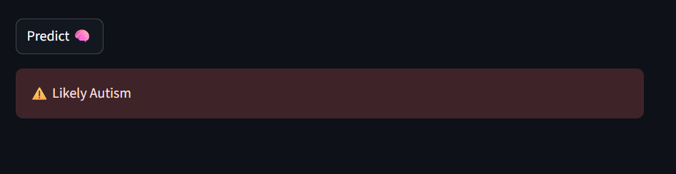
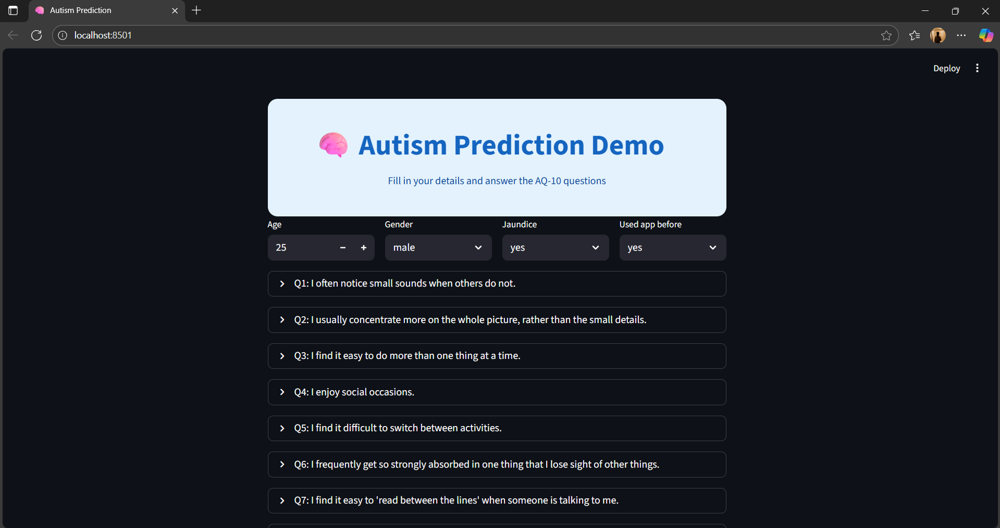

# **🧠 Autism Prediction Demo**

A **machine learning-based demo app** that predicts the likelihood of autism based on **AQ-10 questionnaire scores** and basic personal information. Built with **Python**, **scikit-learn**, and **Streamlit** for an interactive, **user-friendly interface**.

---

## **✨ Features**

- **Bright, clean, and user-friendly interface**
- **Interactive AQ-10 questionnaire** with icons for each question
- **Expandable question sections** to reduce clutter
- **Real-time prediction** using a trained ML model
- **Light theme** for professional and approachable look
- **Educational demo only** (not a medical diagnostic tool)

---

## **📸 Screenshots**

<!-- Add your app screenshots here -->
  

---

## **🚀 How to Run Locally**

1. **Clone this repository**
     git clone (https://github.com/Kartiks133/Autism_Prediction_Software.git)
2. **Navigate to the project folder**
     cd autism-prediction-app
3. **Install dependencies**
     pip install -r requirements.txt
4. **Run the Streamlit app**
     streamlit run autism_app.py

